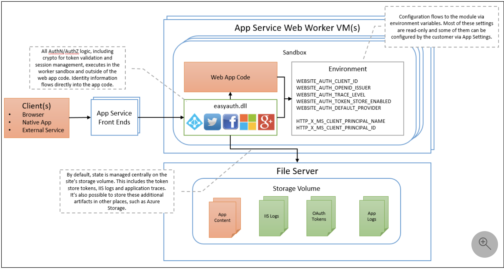
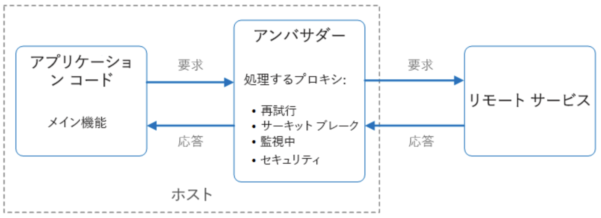
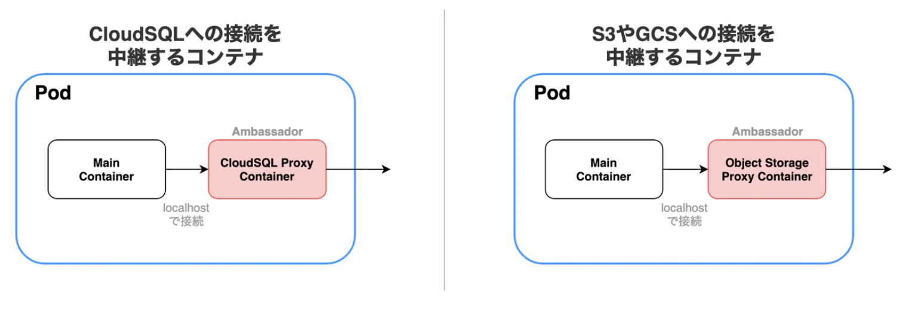

# Azure App Service で Easy Auth を利用した認証ページを作成する

## 目的

- App Service における Easy Auth の機能を確認する。

## 前提

- Azure Subscription を保有していること。
- App Service にアプリケーションをデプロイする権限を保有していること。

## 結論

- ASP.NET Core を使用する際、 App Service の Easy Auth を使用すると、認証・認可を簡単に導入可能になるため、設計時に検討することをオススメする。
- 認証されていないリクエストの振る舞いを下記のように定義可能であるため、設計時に考慮すること。
    - HTTP 302 Found redirect : Web サイトなどで、ログインページに推移させる時などに使用可能。
    - HTTP 401 Unauthorized : API などで、フロント側で認証されていないリクエストには応答しない。
    - HTTP 403 Forbidden : アクセスを禁止する。

## Easy Auth を使用するメリット

Easy Auth は、その名の通り、App Service の機能を活用して、簡単に認証・認可機能を実装する仕組みのこと。
アプリケーションコードを修正する必要はなく、 IdP の統合も可能。

## Easy Auth のアーキテクチャ

Windows / Linux（コンテナ） それぞれで、若干アーキテクチャが異なるが、仕組みは同じ。

### Windows

Easy Auth のモジュールは、アプリケーションコードと同一サンドボックスにて実行される。<br>
Easy Auth が有効化されている場合、全ての HTTP リクエストは、 Easy Auth モジュールを通過するようになる。<br>
Easy Auth モジュール通過後、アプリケーションコードが実行される。



Easy Auth モジュールによって、下記の処理が行われる。

- 指定された IdP でユーザを認証する。
- Token を検証・格納・更新する。
- 認証されたセッションを管理する。
- リクエストヘッダに ID 情報を Insert する。

これらの処理は、アプリケーションの設定を使って構成され、内部的に処理をしてくれる。
よって、アプリケーションコードの修正は不要。

### Linux（コンテナ）

アプリケーションコードとは分離した別のコンテナで実行され、 Windows の場合と同様の機能を実現している。
これは、<b>アンバサダーパターン</b>という、コンテナデザインパターンの一つを用いて実現されている。



上図でいうと、「アンバサダー」コンテナにて Easy Auth のモジュールが動作する。
アプリケーションにて必要な情報は、リクエストヘッダを介してやり取りされる。

#### 【補足】アンバサダーパターン

コンテナデザインパターンの一つ。
アンバサダーパターンは、メインのコンテナと、外部システムとの接続を中継するコンテナで構成される。
例えば、データベースや、S3 / Blob Storage などのオブジェクトストレージ ( = リモートサービス) と接続するアプリケーションがある場合を考える。
アプリケーションからリモートサービスに対する接続を定義する場合、以下の方式が考えられる。

- 接続先を環境変数として指定する
例えば、環境変数を用意し、アプリケーションからは環境変数を読むことで、リモートサービスに対して接続をすることも可能である。
しかし、この方式を採用した場合、アプリケーションとリモートサービスの結合度が強くなってしまう課題が残る。

- Proxy Container を配置し、接続定義を Proxy Container に依存する ( <b>= アンバサダーパターン</b> )
リモートサービスに対する接続定義を Proxy Container に一任する方式を採用することで、アプリケーションとリモートサービスの結合度を下げることが可能である。
すなわち、アプリケーション からは、 `localhost` を指定して、 Proxy Container に接続定義をする。
一方、Proxy Container では、リモートサービスに対する接続を定義する。
これにより、アプリケーションは環境による差異を考慮する必要がなくなる。



## 認証フロー
IdP の SDK でサインインするかによって異なる。

なお、内部的には専用の Cookie (AppServiceAuthentication cookie) が使用されている。
App Service は、 IdP の認証に成功すると、 IdP 用の Token を受け取り、内部で App Service にアクセスするための専用の　Token (Access Token） を生成して、情報を encrypt して設定している。

- IdP の SDK を使わない場合<br>
アプリケーションは、フェデレーションサインインを App Service に委任する。一般的に Web アプリケーションにて使用される。
バックエンド主導で行われる認証方式であり、実装に際してクライアントサイドのコードは不要。
バックエンドに対して、 IdP の OAuth Token を Post することでセッションを確立する。
簡単に実装できる一方で、柔軟性には欠ける。 Web アプリケーションに対して最適な方式である。

```powershell
POST /.auth/login/aad HTTP/1.1
Content-Type: application/json

{"id_token":"<JWT>","access_token":"<JWT>"}
```

- IdP の SDK を使う場合<br>
アプリケーションコード側にてサインインプロセスを管理する。
REST API や Azure Function など、柔軟にカスタマイズしたいアプリケーションに対して使用される。
サーバーサイドの認証モジュールは、クライアントサイドと IdP 間のやり取りを考慮しないで実装可能。
柔軟な方式を採用できるため、本番環境で使用することを推奨。

| 手順 | プロバイダーの SDK を使わない場合 | プロバイダーの SDK を使う場合 |
| :--- | :--- | :--- |
1.ユーザーをサインインさせる | クライアントを `/.auth/login/<provider>` にリダイレクトする。 | クライアント コードはプロバイダーの SDK でユーザーを直接サインインさせ、認証トークンを受け取る。 詳しくは、プロバイダーのドキュメントを参照すること。 |
| 2.認証をポストする | プロバイダーはクライアントを `/.auth/login/<provider>/callback` にリダイレクトする。 | クライアント コードは検証のためにプロバイダーからのトークンを `/.auth/login/<provider>` にポストする。 |
| 3.認証済みのセッションを確立する | App Service は認証された Cookie を応答に追加する。 | App Service は独自の認証トークンをクライアント コードに返す。 |
| 4.認証済みのコンテンツを提供する | クライアントは以降の要求に認証クッキーを含める (ブラウザーによって自動的に処理される)。 | クライアント コードは `X-ZUMO-AUTH` ヘッダーで認証トークンを提示する (Mobile Apps クライアント SDK によって自動的に処理される)。 |

以下、認証フローのログを示す。

```log
#Software: Microsoft Internet Information Services 8.0
#Fields: date time s-sitename cs-method cs-uri-stem cs-uri-query s-port cs-username c-ip cs(User-Agent) cs(Cookie) cs(Referer) cs-host sc-status sc-substatus sc-win32-status sc-bytes cs-bytes time-taken
2021-05-29 03:30:16 ~1APP-SERVICE-EASY-AUTH GET /api/siteextensions api-version=2018-11-01&X-ARR-LOG-ID=c9005dce-f76a-4dc6-8cfb-9286114c8cca 443 - 13.89.171.0 - - https://management.azure.com/subscriptions/1b8e30ae-83d6-48ec-8d25-d083eec0e754/resourceGroups/app-service-rg/providers/Microsoft.Web/sites/app-service-easy-auth/extensions/api/siteextensions?api-version=2018-11-01 app-service-easy-auth.scm.azurewebsites.net 200 0 0 732 3025 1296
2021-05-29 03:30:31 APP-SERVICE-EASY-AUTH GET / X-ARR-LOG-ID=37d510b3-48dd-4a1f-8588-de9ef35f88b5 443 - 126.79.194.234 Mozilla/5.0+(Macintosh;+Intel+Mac+OS+X+10_14_5)+AppleWebKit/537.36+(KHTML,+like+Gecko)+Chrome/90.0.4430.212+Safari/537.36 - - app-service-easy-auth.azurewebsites.net 302 0 0 1493 1377 424
2021-05-29 03:30:32 APP-SERVICE-EASY-AUTH GET / X-ARR-LOG-ID=2a2466a8-91b4-4d11-9ecd-ce7b49d05727 80 - ::1 AlwaysOn ARRAffinity=06e9c0577ff5aa9b2b3f9df43bd4ca9f9052441da2cada4d649b5906eccd1b15 - app-service-easy-auth.azurewebsites.net 401 71 2147500037 654 739 29
2021-05-29 03:30:36 ~1APP-SERVICE-EASY-AUTH GET / - 80 - 10.0.128.26 AlwaysOn - - app-service-easy-auth.azurewebsites.net 200 0 0 3137 481 3783
2021-05-29 03:30:43 APP-SERVICE-EASY-AUTH GET / X-ARR-LOG-ID=83ad11ac-075b-4e50-8469-e9fb56bcebf2 80 - ::1 AlwaysOn ARRAffinity=06e9c0577ff5aa9b2b3f9df43bd4ca9f9052441da2cada4d649b5906eccd1b15 - app-service-easy-auth.azurewebsites.net 401 71 2147500037 654 739 19
2021-05-29 03:30:43 ~1APP-SERVICE-EASY-AUTH GET / - 80 - 10.0.128.26 AlwaysOn - - app-service-easy-auth.azurewebsites.net 200 0 0 3138 481 19
2021-05-29 03:31:15 APP-SERVICE-EASY-AUTH POST /.auth/login/aad/callback X-ARR-LOG-ID=f31c474a-6629-4831-8176-ba9dc4fde91b 443 - 126.79.194.234 Mozilla/5.0+(Macintosh;+Intel+Mac+OS+X+10_14_5)+AppleWebKit/537.36+(KHTML,+like+Gecko)+Chrome/90.0.4430.212+Safari/537.36 Nonce=i8QIHhpPzIygVpqxs+IPO5qULGQ7uP0KBGhu7GZgY9FYiUWq0Y9zixIXzyISpyVdkbpYVMVMOqoSeJtTNNvdEOrJrdBDpZ8zrkj1sxt/V3c1QJN3v807LBfN0vsxt0LB;+ARRAffinity=06e9c0577ff5aa9b2b3f9df43bd4ca9f9052441da2cada4d649b5906eccd1b15;+ARRAffinitySameSite=06e9c0577ff5aa9b2b3f9df43bd4ca9f9052441da2cada4d649b5906eccd1b15 https://login.microsoftonline.com/ app-service-easy-auth.azurewebsites.net 302 0 0 2057 4926 1010
2021-05-29 03:31:15 APP-SERVICE-EASY-AUTH GET / X-ARR-LOG-ID=a7fa82f9-9341-482e-9fbd-9bdf3ee2aeac 443 kk.31108424@gmail.com 126.79.194.234 Mozilla/5.0+(Macintosh;+Intel+Mac+OS+X+10_14_5)+AppleWebKit/537.36+(KHTML,+like+Gecko)+Chrome/90.0.4430.212+Safari/537.36 ARRAffinity=06e9c0577ff5aa9b2b3f9df43bd4ca9f9052441da2cada4d649b5906eccd1b15;+ARRAffinitySameSite=06e9c0577ff5aa9b2b3f9df43bd4ca9f9052441da2cada4d649b5906eccd1b15;+AppServiceAuthSession=BFAE1FFabjvnEEA9DsW1NWyFvyuI8mVwLdohPHYlzr1a4OMB2+e+IjM7ZDgpiM6dLIMn4s0YXkz9Udk7nntRzYVJHp5ITUr9mW/J4yB8sWArLFrxk4VB1N4j93eAiaskFbwuBzqaRQFwBecBYzVtVC1VjuXPtEOb49hd3FCrq611eldW1ROEcD0OmRj4ZfLZpb1cgQbl/tVkQ/Lvz4TsdvcZ5+iRhfwezgLB9ZaMEw44LrfACWqZAza/ZIXkw/P1G9kOQYE4QDp+5IQ7Fk1mDsRqR510QAKgKH/lo7/7HU/GNOv55IA62TQRMQn/dmtb+tL8hYYbgJTgZODYOe78KCIwJnVVrM0y2RyTO2sVRwFM2DdotRy4kKBQj1J+uTq3ZfV49uMrKq+pmA6RKIjNFZggXWnlZ/BBE81y/MVV1WKsLg+rFTQvI6ZthMAudAgVHILBywXqAaKBJJmJ5bLz9U2K6KLjUf+qQdvHQbJocT34VKwEh3pcLk6hG6Hf9Pn/1iJR5vTtTuhapD9DGPc3Vg8pwuX2/x+LcP4vwgJYnk/iV4DWV15iijZC7vWpePTqSNOA7T70wpDXVGYw5gYHlguITkSFWT+NIm5lOYh7cFPyxc8ssNQXsqc7L66Mw0b1P5eqKvnJMGCGeI+Ly4yHj+jOMBYOEU3ZofcyUXEz/QD13rp+zc0le8yrpsKlK9xbb5Clg8Yw8yh8oC/LPjIpvMNx8c+cPxtIQxNiW1z8WWzcIhEkg+oKG+XL9Gr3Zc6SR+LwbOscDVqOfrAvrMZvh6mglIX3evWM/rntVU1WWzVIRxls6zdg7D6qospSbB4D8DEKEfD3fSxnwS1XJCS1fBrps3T8OphRDjJSB0nbpD+MLt/NOOT/UPuzODiMQeygLZCuM72wTCnK4rCMi92peV8PjsCu2uidWdxjyh6E3AZ4XYlLWqZvQ58/Ai3lVnw7OGh9HkzyPm3b9jejYRPPmztO+6k5OAMicrdKZqZ+afhjbk2axdwotAQrUbgYLnNrF6vbCv/+UYRMRcY2OsbAZe1JzbGIhcVpqtmRwDGqZvcRiDFTm2ZFQbsdPbHMmcerNJX5eOfAxfkZZWULRbeIHbm2eodYx61dGHNmNO2DJFCNL24opWrZftErhH43iAbvi7cE//JJB8Zwat7gHv11My7LbIu4BJYUa8yIOPHiwYRQcQ6K+40V7YOVvPeD7yHb https://login.microsoftonline.com/ app-service-easy-auth.azurewebsites.net 200 0 0 2169 2846 203
2021-05-29 03:32:57 ~1APP-SERVICE-EASY-AUTH GET /api/siteextensions api-version=2018-11-01&X-ARR-LOG-ID=ea5f2ed3-7561-489d-b5ec-297938772953 443 - 13.89.171.0 - - https://management.azure.com/subscriptions/1b8e30ae-83d6-48ec-8d25-d083eec0e754/resourceGroups/app-service-rg/providers/Microsoft.Web/sites/app-service-easy-auth/extensions/api/siteextensions?api-version=2018-11-01 app-service-easy-auth.scm.azurewebsites.net 200 0 0 732 3023 921
2021-05-29 03:33:12 ~1APP-SERVICE-EASY-AUTH GET /api/siteextensions api-version=2018-11-01&X-ARR-LOG-ID=536cd0b6-7665-4188-bb9a-8cd4882fc993 443 - 13.89.171.0 - - https://management.azure.com/subscriptions/1b8e30ae-83d6-48ec-8d25-d083eec0e754/resourceGroups/app-service-rg/providers/Microsoft.Web/sites/app-service-easy-auth/extensions/api/siteextensions?api-version=2018-11-01 app-service-easy-auth.scm.azurewebsites.net 200 0 0 732 3025 63
2021-05-29 03:33:33 APP-SERVICE-EASY-AUTH GET / X-ARR-LOG-ID=dda7d65e-a114-4c33-9c71-ecb41d039ff7 80 - ::1 AlwaysOn ARRAffinity=06e9c0577ff5aa9b2b3f9df43bd4ca9f9052441da2cada4d649b5906eccd1b15 - app-service-easy-auth.azurewebsites.net 401 71 2147500037 654 739 248
2021-05-29 03:33:37 ~1APP-SERVICE-EASY-AUTH GET / - 80 - 10.0.128.26 AlwaysOn - - app-service-easy-auth.azurewebsites.net 200 0 0 3137 481 4152
2021-05-29 03:33:40 APP-SERVICE-EASY-AUTH GET / X-ARR-LOG-ID=6b524703-b4e8-46ed-995b-408e5b23baca 443 - 126.79.194.234 Mozilla/5.0+(Macintosh;+Intel+Mac+OS+X+10_14_5)+AppleWebKit/537.36+(KHTML,+like+Gecko)+Chrome/90.0.4430.212+Safari/537.36 - - app-service-easy-auth.azurewebsites.net 302 0 0 1493 1377 32
2021-05-29 03:33:43 APP-SERVICE-EASY-AUTH GET / X-ARR-LOG-ID=0b3e5d93-399a-42ba-be31-57c07b2d2e96 80 - ::1 AlwaysOn ARRAffinity=06e9c0577ff5aa9b2b3f9df43bd4ca9f9052441da2cada4d649b5906eccd1b15 - app-service-easy-auth.azurewebsites.net 401 71 2147500037 654 739 19
2021-05-29 03:33:43 ~1APP-SERVICE-EASY-AUTH GET / - 80 - 10.0.128.26 AlwaysOn - - app-service-easy-auth.azurewebsites.net 200 0 0 3138 481 19
```

## 認可の動作

リクエストが認証されていない場合、以下のオプションを指定可能

- 認証されていないリクエストを許可する
例えば、複数のサインインプロバイダーを提示するなど、認証されていない場合のカスタマイズが可能。
ただし、以下のようにコードを書く必要がある。

```html
<a href="/.auth/login/aad">Log in with the Microsoft Identity Platform</a>
<a href="/.auth/login/facebook">Log in with Facebook</a>
<a href="/.auth/login/google">Log in with Google</a>
<a href="/.auth/login/twitter">Log in with Twitter</a>
<a href="/.auth/login/apple">Log in with Apple</a>
```

- 認証を必須にする
認証されていないリクエストは拒否する。これにより、 IdP へのリダイレクトが行われ、ログイン時に選択した IdP への `/.auth/login/<provider>` にブラウザークライアントがリダイレクトされる。

## リクエストヘッダへの Token 挿入

Azure App Service では、全ての言語フレームワークにおいて、リクエストヘッダにトークンの Claim を挿入することで、コード内でトークンを使用することが可能。
例えば、バックエンドで ASP.NET 4.6 を使用している場合を考える。
App Service は、認証されたユーザのリクエストで、 [ClaimsPrincipal.Current](https://docs.microsoft.com/ja-jp/dotnet/api/system.security.claims.claimsprincipal.current?view=net-5.0) を内部的に設定する。
そのため、標準の .NET コードパターン (`[Authorize]` 属性など) を使用することができる。

.NET Core では、`Microsoft.Identity.Web` により、現在のユーザに対して Easy Auth の機能をサポートしている。

## アプリケーションコードでのトークンの取得

各 IdP ごとに固有のトークンがリクエストヘッダに挿入されるため、アプリケーションコードからトークンに簡単にアクセス可能。

以下で、取得可能なトークンヘッダーをまとめる。

| IdP | ヘッダー名 |
| :--- | :--- |
| Azure Active Directory | `X-MS-TOKEN-AAD-ID-TOKEN` <br> `X-MS-TOKEN-AAD-ACCESS-TOKEN` <br> `X-MS-TOKEN-AAD-EXPIRES-ON` <br> `X-MS-TOKEN-AAD-REFRESH-TOKEN`|
| Facebook | `X-MS-TOKEN-FACEBOOK-ACCESS-TOKEN` <br> `X-MS-TOKEN-FACEBOOK-EXPIRES-ON`|
| Google | `X-MS-TOKEN-GOOGLE-ID-TOKEN` <br> `X-MS-TOKEN-GOOGLE-ACCESS-TOKEN` <br> `X-MS-TOKEN-GOOGLE-EXPIRES-ON` <br> `X-MS-TOKEN-GOOGLE-REFRESH-TOKEN`|
| Twitter | `X-MS-TOKEN-TWITTER-ACCESS-TOKEN` <br> `X-MS-TOKEN-TWITTER-ACCESS-TOKEN-SECRET` |

## Tips

### App Service へ ASP.NET Web アプリをデプロイ

手順は[こちら](https://docs.microsoft.com/ja-jp/azure/app-service/quickstart-dotnetcore?tabs=net50&pivots=development-environment-vscode)を参照すること。
アウトプットは、下記のようになる。

```log
3:15:30 PM app-service-easy-auth: Starting deployment...
3:15:34 PM app-service-easy-auth: Creating zip package...
3:15:36 PM app-service-easy-auth: Zip package size: 993 kB
3:15:37 PM app-service-easy-auth: Updating submodules.
3:15:37 PM app-service-easy-auth: Preparing deployment for commit id 'c28c083b6f'.
3:15:38 PM app-service-easy-auth: Generating deployment script.
3:15:38 PM app-service-easy-auth: Using the following command to generate deployment script: 'azure site deploymentscript -y --no-dot-deployment -r "D:\local\Temp\zipdeploy\extracted" -o "D:\home\site\deployments\tools" --basic --sitePath "D:\local\Temp\zipdeploy\extracted"'.
3:15:39 PM app-service-easy-auth: Generating deployment script for Web Site
3:15:39 PM app-service-easy-auth: Running deployment command...
3:15:39 PM app-service-easy-auth: Command: "D:\home\site\deployments\tools\deploy.cmd"
3:15:42 PM app-service-easy-auth: Handling Basic Web Site deployment.
3:15:43 PM app-service-easy-auth: Creating app_offline.htm
3:15:43 PM app-service-easy-auth: KuduSync.NET from: 'D:\local\Temp\zipdeploy\extracted' to: 'D:\home\site\wwwroot'
3:15:43 PM app-service-easy-auth: Deleting file: 'hostingstart.html'
3:15:43 PM app-service-easy-auth: Copying file: 'appsettings.Development.json'
3:15:43 PM app-service-easy-auth: Copying file: 'appsettings.json'

・・・

3:15:44 PM app-service-easy-auth: Copying file: 'web.config'
3:15:44 PM app-service-easy-auth: Deleting app_offline.htm
3:15:44 PM app-service-easy-auth: Finished successfully.
3:15:44 PM app-service-easy-auth: Running post deployment command(s)...
3:15:44 PM app-service-easy-auth: Triggering recycle (preview mode disabled).
3:15:44 PM app-service-easy-auth: Deployment successful.
3:16:09 PM: Deployment to "app-service-easy-auth" completed.
```

デプロイ中にアプリケーションにアクセスがあると、「Site Under Construction」というタイトルが表示される。
画面は表示されない。

### Chrome 開発者コンソールでの HTTP メソッドの実行

```powershell
var xhr = new XMLHttpRequest();
xhr.open('GET', 'https://example.com?hoge=piyo');
xhr.send();
```

レスポンスはNetworkタブで見る。

## 参考

- [開発者リポジトリ](https://github.com/cgillum/easyauth)
- [Azure App Service および Azure Functions での認証と承認](https://docs.microsoft.com/ja-jp/azure/app-service/overview-authentication-authorization)
- [Azure App Service 上での認証と承認の高度な使用方法](https://docs.microsoft.com/ja-jp/azure/app-service/app-service-authentication-how-to)
- [クイックスタート: ASP.NET Web アプリをデプロイする](https://docs.microsoft.com/ja-jp/azure/app-service/quickstart-dotnetcore?tabs=net50&pivots=development-environment-vscode)