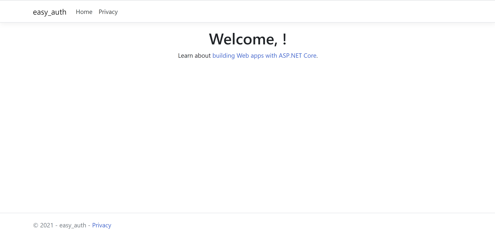
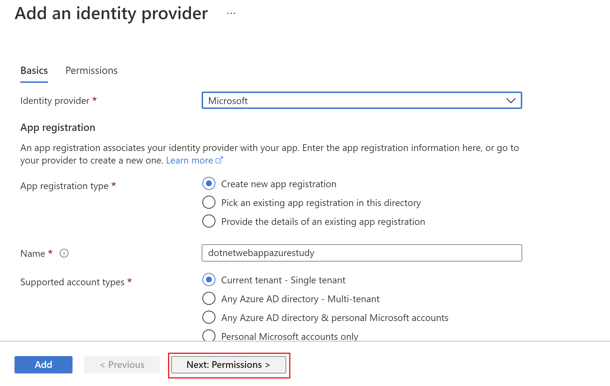
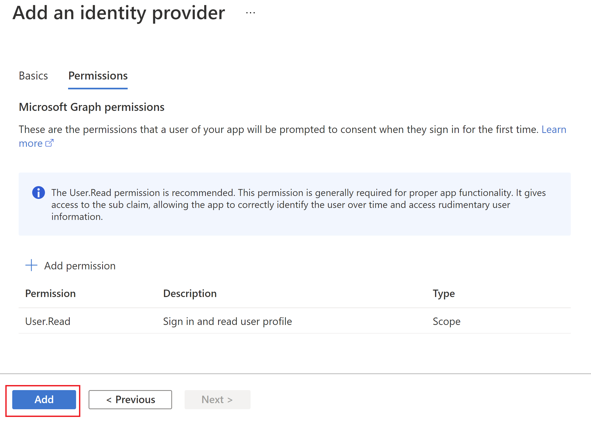

# Azure App Service with Easy Auth

このコンテンツは、 Azure Study #5 PaaS 編用に作成されました。

内容
=================

- [Azure App Service with Easy Auth](#azure-app-service-with-easy-auth)
- [Table of Contents](#table-of-contents)
- [Architecture](#architecture)
  * [Getting Started](#getting-started)
    + [1. Prerequisites](#1-prerequisites)
      - [Optional](#optional)
    + [2. Develop application locally](#2-develop-application-locally)
    + [3. Create Azure resources](#3-create-azure-resources)
    + [4. Deploy to Web Apps with Visual Studio Code](#4-deploy-to-web-apps-with-visual-studio-code)
    + [5. Enable Azure AD authentication](#5-enable-azure-ad-authentication)
    + [6. Access to Web App](#6-access-to-web-app)
  * [References](#references)

Architecture
=================

このチュートリアルでは、.NET Framework のアプリケーション名を Azure App Service Web Apps にデプロイします。

また、Azure Portal で Easy Auth を有効化し、アプリケーションコードを修正せず、認証認可を有効化する方法を確認します。

## Getting Started

### 1. 前提

- Microsoft Azure Subscription
- .NET Framework 5 or higher

#### あると望ましいもの

- `az` command
- Visual Studio Code ([インストール方法](https://code.visualstudio.com/download))

### 2. Develop application locally

このリポジトリを Clone し、ローカルでアプリケーションを起動してください。

```shell
git clone https://github.com/kohei3110/auth-app-service.git
cd auth-app-service
```

```shell
dotnet run
```

[https://localhost:5001/](https://localhost:5001/)にアクセスすると、以下のように表示されます。



### 3. Azure リソースの作成

`azure-templates/README.md` にあるボタンをクリックし、Azure にリソースを作成します。

### 4. Deploy to Web Apps with Visual Studio Code

Azure Extensions をまだインストールしていない場合は、この段階でインストールしてください。
インストール方法は([こちら](https://code.visualstudio.com/docs/azure/extensions))です。

Web Apps にアプリケーションをデプロイするには、以下の画面のようにボタンをクリックするだけです。


デプロイ時のログの例を下記に示します。これは、OUTPUT ウィンドウで確認することができます。

```log
3:15:30 PM app-service-easy-auth: Starting deployment...
3:15:34 PM app-service-easy-auth: Creating zip package...

・・・

3:15:44 PM app-service-easy-auth: Deployment successful.
3:16:09 PM: Deployment to "app-service-easy-auth" completed.
```

### 5. Enable Azure AD authentication

Azure AD と統合した認証・認可を、 Azure Portal からとても簡単に有効化することができます。以下の図のように、認証プロバイダを選択し、適切に権限を設定するだけです。






### 6. Access to Web App

先ほどデプロイしたアプリケーションに再度アクセスしてみましょう。すると、以下のようにアクセス許可を求められます。


アクセス許可後、以下のように、アプリケーション上でプリンシパル ID を確認することができます。


これは、`Startup.cs` において、認証プロバイダによって埋め込まれた `X-MS-CLIENT-PRINCIPAL-NAME` を取得し、画面上に表示するようプログラムを組んでいるからです。

```CSharp
・・・
            app.Use(async (context, next) => 
            {
                if (context.Request.Headers.ContainsKey("X-MS-CLIENT-PRINCIPAL-NAME"))
                {
                    var azureAppServicePrincipalNameHeader = context.Request.Headers["X-MS-CLIENT-PRINCIPAL-NAME"][0];
                    var identity = new GenericIdentity(azureAppServicePrincipalNameHeader);
                    context.User = new GenericPrincipal(identity, null);
                }

・・・
```

## References

- [Authentication and authorization in Azure App Service and Azure Functions](https://docs.microsoft.com/en-us/azure/app-service/overview-authentication-authorization)