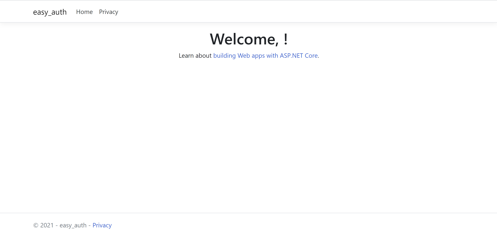
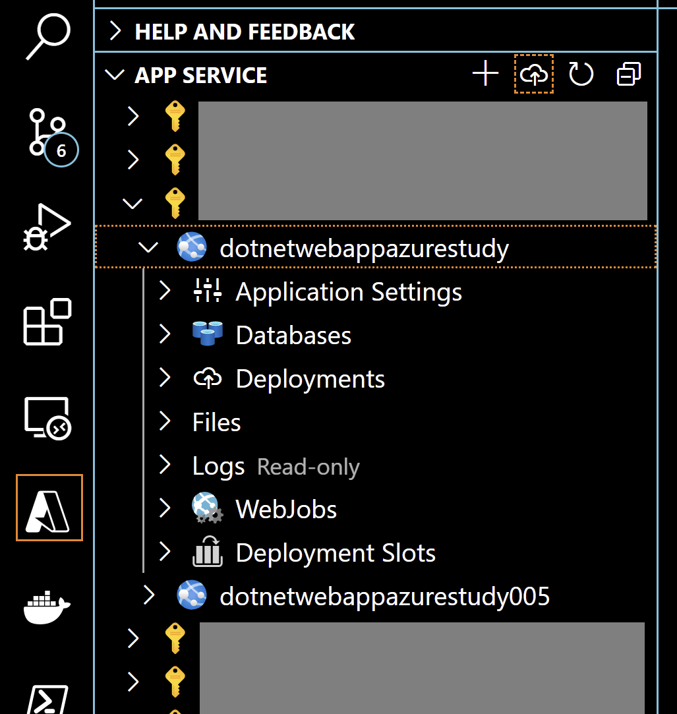
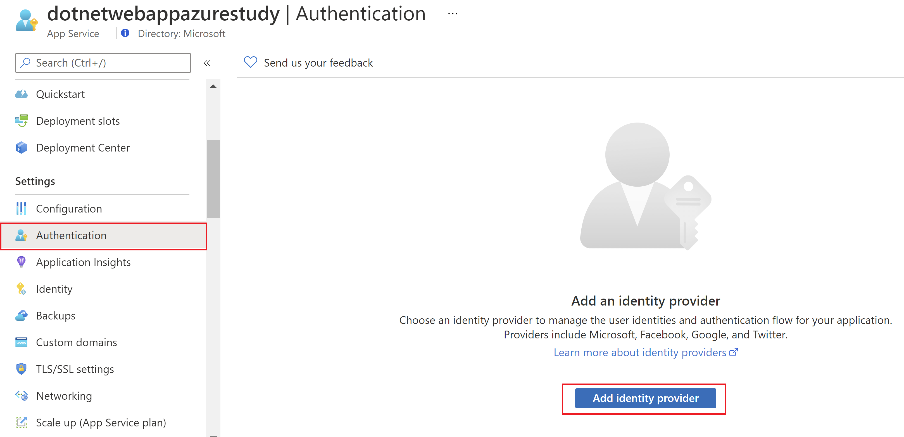
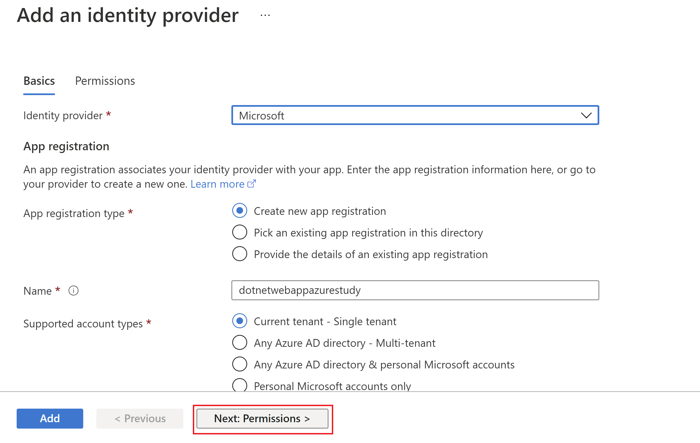
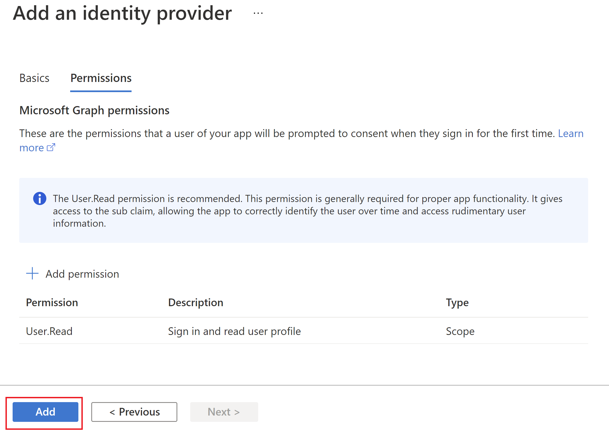
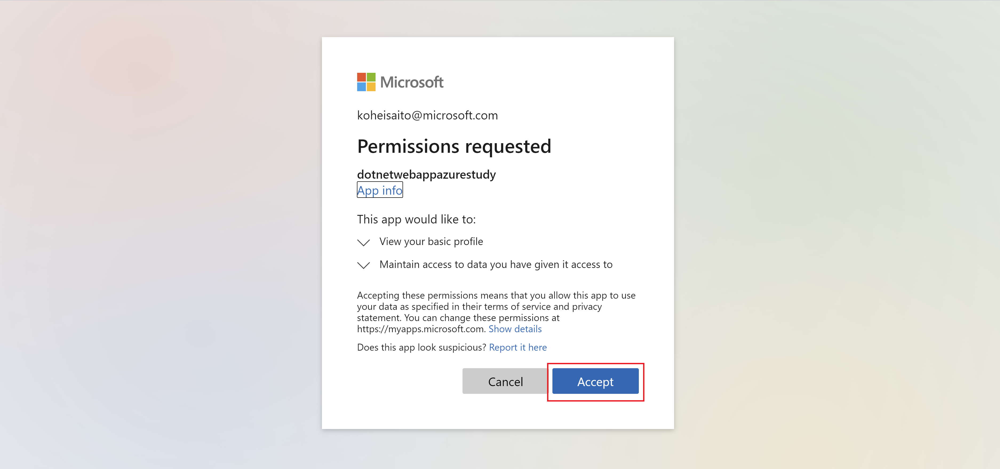
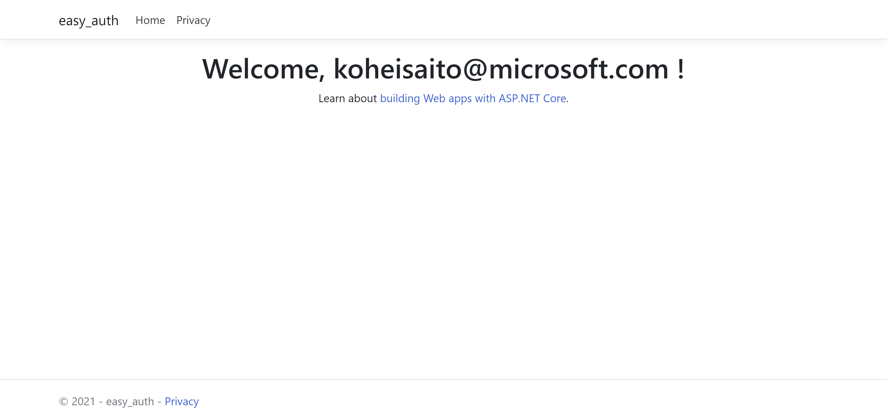

# Azure App Service with Easy Auth

This content was created for Azure Study #5 demo.

Table of Contents
=================

- [Azure App Service with Easy Auth](#azure-app-service-with-easy-auth)
- [Table of Contents](#table-of-contents)
- [Architecture](#architecture)
  * [Getting Started](#getting-started)
    + [1. Prerequisites](#1-prerequisites)
      - [Optional](#optional)
    + [2. Develop application locally](#2-develop-application-locally)
    + [3. Create Azure resources](#3-create-azure-resources)
    + [4. Deploy to Web Apps with Visual Studio Code](#4-deploy-to-web-apps-with-visual-studio-code)
    + [5. Enable Azure AD authentication](#5-enable-azure-ad-authentication)
    + [6. Access to Web App](#6-access-to-web-app)
  * [References](#references)

Architecture
=================

In this tutorial, you just deploy dotnet application to Azure App Service Web Apps.

Also, you enable Easy Auth in Azure Portal.

## Getting Started

### 1. Prerequisites

- Microsoft Azure Subscription
- .NET Framework 5 or higher

#### Optional

- `az` command
- Visual Studio Code ([How to install](https://code.visualstudio.com/download))

### 2. Develop application locally

Clone this repositry and start application.

```shell
git clone https://github.com/kohei3110/auth-app-service.git
cd auth-app-service
```

```shell
dotnet run
```

Access to [https://localhost:5001/](https://localhost:5001/).



### 3. Create Azure resources

Just click  button in `azure-templates/README.md`.

### 4. Deploy to Web Apps with Visual Studio Code

Install Azure Extension if not yet ([How to install](https://code.visualstudio.com/docs/azure/extensions)).

Just deploy like below.



Here is an log example while deploying. You can check this in OUTPUT window.

```log
3:15:30 PM app-service-easy-auth: Starting deployment...
3:15:34 PM app-service-easy-auth: Creating zip package...

・・・

3:15:44 PM app-service-easy-auth: Deployment successful.
3:16:09 PM: Deployment to "app-service-easy-auth" completed.
```

### 5. Enable Azure AD authentication

You can enable Azure AD authentication so easily. You just add an IdP and select permissions properly like below.







### 6. Access to Web App

Again, access to Web App URL you deployed. You are prompted to access your application like below.



You can see your principal id in the top page like below.



The reason is, in `Startup.cs`, program gets your `X-MS-CLIENT-PRINCIPAL-NAME`, which is the embedded information by IdP (in this case, Azure AD).

```CSharp
・・・
            app.Use(async (context, next) => 
            {
                if (context.Request.Headers.ContainsKey("X-MS-CLIENT-PRINCIPAL-NAME"))
                {
                    var azureAppServicePrincipalNameHeader = context.Request.Headers["X-MS-CLIENT-PRINCIPAL-NAME"][0];
                    var identity = new GenericIdentity(azureAppServicePrincipalNameHeader);
                    context.User = new GenericPrincipal(identity, null);
                }

・・・
```

## References

- [Authentication and authorization in Azure App Service and Azure Functions](https://docs.microsoft.com/en-us/azure/app-service/overview-authentication-authorization)